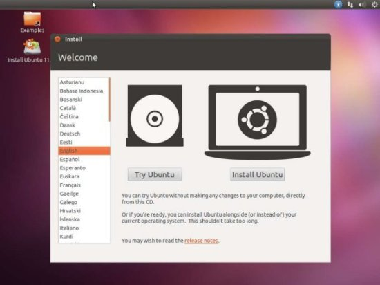
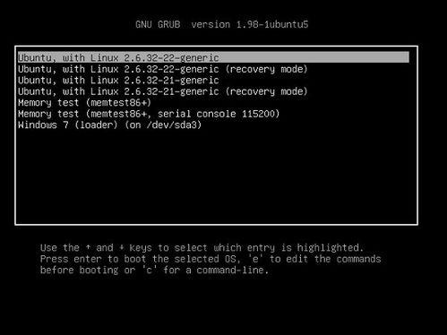
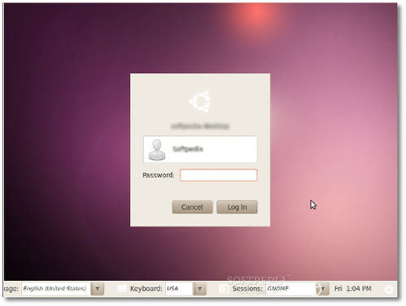

# 双系统的安装

1. 通过windows自带的磁盘管理程序划出一个Linux系统使用的未使用空间
*  在ubuntu的官方网站下载最新的ubuntu桌面系统

因为我的windows系统装在了UEFI上，所以只能下载64位的ubuntu 。最终下载得到的是一个大小为700M左右的iso镜像文件，比如“ubuntu-10.10-desktop-i386.iso”。
* 制作系统盘
* 在开机时按f2键（具体决定于机型，通常是F2），进入BIOS程序修改开机程序，选择从u盘启动
* 短暂等待后，点击桌面上放的“Install Ubuntu XXX”的快捷方式，将会弹出一个完全图形化的向导安装，按照说明完成安装，完成后才可拔出U盘

* 开机后选择nbuntu系统，即可正常进入。

